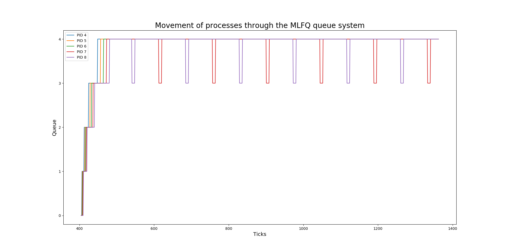

# Improved Xv6 

# added features 

* ##  waitx syscall
Added a new syscall `int waitx(int* wttime,int* rtime)` which makes the parent wait for its children to finish execution and then return the total wait time and the total runtime (in ticks) (approx 10ms). runtime includes the time the process was runnimg i.e. using the CPU. whereas wait time is the difference of total time it took for entire execution minus the runtime. hence waittime also includes the time it spent using input output resources.
* ## test (time) command 
this command is used to test the waitx syscall and also to print the runtime and waittime of any other process (command). To use type `test command` on the shell
* ##  Getpinfo syscall
`int getpinfo (int pid,struct proc_stat*)` \
A new System call used to populate a struct with the basic information regarding the given process (through pid).

* ## set_priority syscall
A new system call which is used to change the priority of an existing process (by giving its pid). Useful when we are using the PBS scheduling. 

* ##  Getpinfo command
a command that takes in the pid through cli and calls the getpinfo syscall and prints the information of the given progess

* ##  ps command
returns basic information regarding every process  from the proc table 

* ## myfile command
just a command which does useless computations to waste CPU time 

# SCHEDULING
* ## FCFS
A scheduling process where the process which is created first is given a higher priority over anny process that is created later. \
To do this we are storing the creation time of each process and in the `scheduler()` function we are choosing the process with minimum start time (or minimum pid since the pid is assigned in order of creation) 

Also there is no pre-emption of processes since the process which is once assigned the processor would work untill it voluntarily leaves the CPU.

* ## PBS
A scheduling process which gives the CPU to the process with highest priority (lowest priority number) and does not change it until another process with a lower priority number comes. \
If there are more processes with same priorities the scheduling is done among them via a round robin scheduling .

* ## MLFQ
There are four queues each with its own priority and its own timeslice. whenever a process is created it is given to queue 0 . once the timeslice expires it moves down to the end of lower priority queue 
### now any process could exploit it by adding outputs at small intervals , now if it leaves a queue for input output before completing the time quantum of that queue it qould again be assigned to the same queue and hence would not degrade to a lower priority. Also it is a fact that MLFQ favours IO bound processess and hence dividing the large CPU time of your process into smaller chunks would exploit the scheduler algorithm

## Comparison Report

Time Take by each scheduler : \
 (for parent process) \
###  Round robin 
wait time = 1957 
runtime = 4
total time for the process - 1961

### FCFS

 wait time = 1923 \
  runtime = 4 \
 total time for the process - 1927

### Priority based 
 wait time = 1923 \
  runtime = 6 \
 total time for the process - 1929

### MLFQ 
 wait time = 1994 \
  runtime = 4 \
 total time for the process - 1998

from comparison we can conclude that for various processes

 round robin was not very efficient due to the over head of context switching at every tick. 

FCFS was efficient because there was no pre-emption and thus overall took less time but also posed other problems like a high response time. and even if the process was short , it had to wait for all the prior processes to complete .

PBS on the other hand was good to manage priorities but did not show any different trends in the overall runtime since all the processes being scheduled were of similar type.

MLFQ was faster and had a small response time . but the overhead of the entire system was significant for small processes 

## Bonus
The graph below shows how various processes transitted accross queues over time due to aging and time slice expiring 

